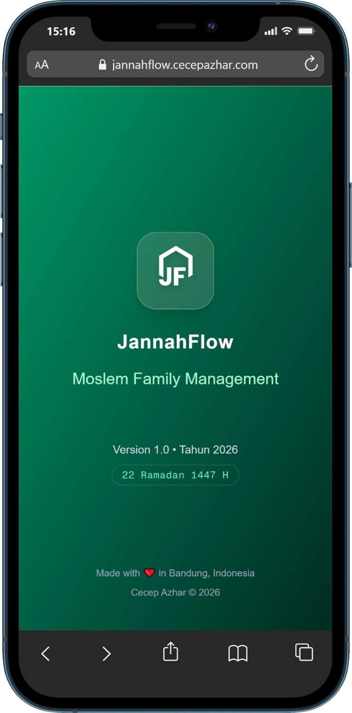

<div align="center">

<h1>🌿 JannahFlow</h1>

<p><strong>Aplikasi Manajemen Keluarga Islami — Mutabaah, Jurnal, Keuangan & Aktivitas Bonding</strong></p>

<p>
  <a href="https://jannahflow.my.id"></a>
  <a href="https://demo.jannahflow.my.id"></a>
</p>

<p>
  
  
  
  
  
  
</p>

<div style="margin-top: 30px;">
  
</div>

</div>

---

## ✨ Tentang JannahFlow

**JannahFlow** adalah aplikasi manajemen keluarga Islami yang membantu keluarga muslim dalam membangun kehidupan yang lebih terarah, berkah, dan produktif — dari ibadah harian hingga keuangan berbasis nilai Islam.

> _"Bangun keluarga impian menuju Jannah, satu hari satu langkah."_

---

## 🎯 Fitur Utama

### 📿 Mutabaah Ibadah

Pantau konsistensi ibadah harian seluruh anggota keluarga — shalat, puasa sunnah, tilawah, dzikir, dan ibadah lainnya. Tampilkan skor poin dan streak harian.

### 📔 Jurnal Keluarga

Tulis catatan harian dengan mood tracking. Tersedia untuk semua anggota keluarga, membangun kebiasaan refleksi dan syukur.

### 💰 Financial Family _(PRO — Eksklusif)_

Sistem keuangan keluarga berbasis nilai Islam:

- **Dompet & Akun** — Pantau saldo tunai, rekening bank, emas, dan investasi
- **Transaksi** — Catat pemasukan & pengeluaran dengan tag Halal-Thayyib dan tanggal Masehi + Hijriyah
- **Anggaran (Budgeting)** — Batas pengeluaran per kategori dengan progress bar real-time & peringatan dini
- **Target Tabungan** — Impian keluarga (Qurban, Haji, Aqiqah, dll.) dengan visualisasi progres dan fitur deposit
- **Aset & Kalkulator Zakat** — Pantau aset jangka panjang dan status Nisab secara otomatis

### 🤝 Bonding Aktivitas

Daftar aktivitas kebersamaan keluarga yang terstruktur — spiritual, bermain, bakti sosial, dan diskusi mendalam.

### 📊 Laporan

Laporan ringkasan mutabaah ibadah dan jurnal per periode, membantu evaluasi keluarga secara berkala.

### ⚙️ Pengaturan & Lisensi Pro

Manajemen anggota keluarga, aktivasi lisensi Pro melalui domain verification berbasis JWT.

---

## 🌐 Demo & Website

|                      | URL                                                    |
| -------------------- | ------------------------------------------------------ |
| 🌐 **Website Resmi** | [jannahflow.my.id](https://jannahflow.my.id)           |
| 🚀 **Demo Langsung** | [demo.jannahflow.my.id](https://demo.jannahflow.my.id) |

---

## 🛠️ Tech Stack

| Layer               | Teknologi                                                     |
| ------------------- | ------------------------------------------------------------- |
| **Framework**       | [Next.js 16](https://nextjs.org) (App Router, Server Actions) |
| **UI**              | React 19, Tailwind CSS 4, Lucide React                        |
| **Database**        | SQLite (lokal) / [Turso](https://turso.tech) (production)     |
| **ORM**             | [Drizzle ORM](https://orm.drizzle.team)                       |
| **Auth / Lisensi**  | JWT via [jose](https://github.com/panva/jose)                 |
| **Kalender Islami** | `Intl.DateTimeFormat` dengan kalender `islamic-umalqura`      |
| **Package Manager** | pnpm                                                          |
| **Bahasa**          | TypeScript                                                    |

---

## 🚀 Menjalankan Secara Lokal

### Prasyarat

- Node.js 20+
- pnpm

### Langkah-langkah

```bash
# 1. Clone repositori
git clone https://github.com/cecep-azhar/jannahflow.git
cd jannahflow

# 2. Install dependensi
pnpm install

# 3. Salin file environment
cp .env.local.example .env

# 4. Isi konfigurasi di .env
# DATABASE_URL=file:local.db  (SQLite lokal)
# Atau untuk Turso:
# TURSO_DATABASE_URL=libsql://...
# TURSO_AUTH_TOKEN=...

# 5. Jalankan development server
pnpm dev
```

Buka [http://localhost:3000](http://localhost:3000) di browser.

Saat pertama kali dijalankan, aplikasi akan memandu Anda melalui halaman **Setup** untuk membuat profil keluarga.

---

## 🗄️ Struktur Database

```
users              → Anggota keluarga (parent / child)
worships           → Daftar ibadah yang dipantau
mutabaah_logs      → Log ibadah harian per anggota
journals           → Catatan jurnal harian
bonding_activities → Aktivitas bonding keluarga
accounts           → Akun/dompet keuangan
transactions       → Riwayat transaksi (INCOME/EXPENSE)
budgets            → Anggaran bulanan per kategori
assets             → Aset jangka panjang
saving_goals       → Target tabungan impian keluarga
quotes             → Kutipan islami
system_stats       → Konfigurasi sistem & token Pro
```

---

## 📁 Struktur Proyek

```
src/
├── app/
│   ├── auth/          → Halaman login & PIN
│   ├── dashboard/     → Beranda utama
│   ├── mutabaah/      → Modul mutabaah ibadah
│   ├── journal/       → Jurnal keluarga
│   ├── finance/       → Financial Family (PRO)
│   │   ├── accounts/
│   │   ├── transactions/
│   │   ├── budgets/
│   │   ├── assets/
│   │   └── saving-goals/
│   ├── bonding/       → Aktivitas bonding
│   ├── report/        → Laporan
│   └── settings/      → Pengaturan & lisensi
├── db/
│   ├── schema.ts      → Drizzle schema
│   └── index.ts       → Koneksi database
├── lib/
│   ├── hijri-utils.ts → Konversi kalender Hijriyah
│   └── pro-utils.ts   → Verifikasi lisensi Pro
└── components/
    └── bottom-nav.tsx → Navigasi bawah
```

---

## 🔐 Lisensi Pro

Fitur **Financial Family** adalah fitur eksklusif yang memerlukan lisensi Pro. Lisensi diverifikasi melalui JWT berbasis domain — satu lisensi berlaku untuk satu domain.

Untuk informasi aktivasi lisensi Pro, kunjungi [jannahflow.my.id](https://jannahflow.my.id) atau hubungi kami via WhatsApp.

---

## 📄 Lisensi

Proyek ini bersifat **proprietary**. Seluruh hak cipta dilindungi.

© 2025 JannahFlow. All rights reserved.

---

<div align="center">
  <strong>Dibuat dengan ❤️ untuk keluarga muslim Indonesia</strong><br/>
  <a href="https://jannahflow.my.id">jannahflow.my.id</a> · <a href="https://demo.jannahflow.my.id">Demo</a>
</div>
